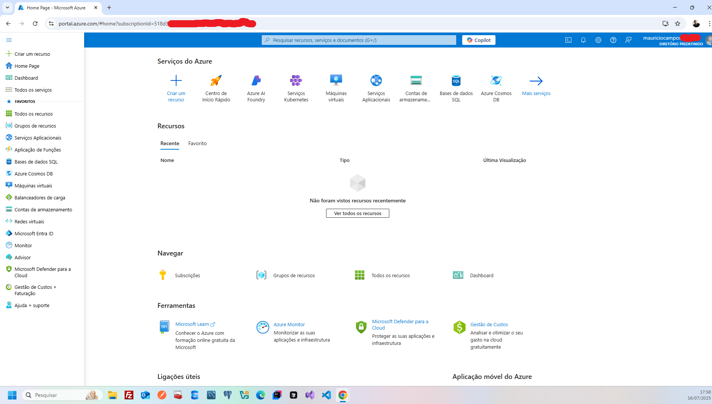
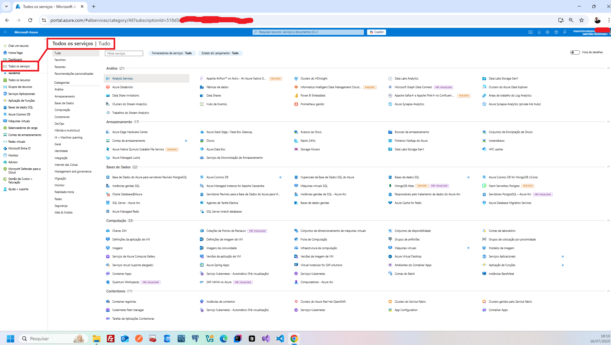

# ☁️ Estudo Técnico – Fundamentos da Computação em Nuvem (AZ-900)

Hoje, enquanto estudava para a certificação **AZ-900**, mergulhei nos conceitos básicos da computação em nuvem e do **Microsoft Azure**. Foi interessante entender como essa tecnologia está transformando a forma como as empresas gerenciam seus recursos de TI.

A seguir, compartilho um resumo técnico do que aprendi:

---

## 1. Introdução à Computação em Nuvem

A **computação em nuvem** é a entrega de serviços de TI via internet como servidores, armazenamento, bancos de dados, redes e software **sem a necessidade de infraestrutura física local**.

Em vez de investir em hardware, as empresas contratam provedores como o **Microsoft Azure**, pagando apenas pelo uso. Os principais benefícios incluem:

- **Escalabilidade**: ajuste dinâmico dos recursos conforme a demanda;
- **Redução de custos**: modelo sob demanda evita investimentos em excesso;
- **Flexibilidade**: acesso remoto e facilidade de gerenciamento.

---

## 2. Modelos de Nuvem

### 🔹 Modelos de Implantação

- **Nuvem Pública**  
  Recursos compartilhados entre várias empresas e fornecidos por um provedor como o Azure.  
  ✅ Ideal para redução de custos.

- **Nuvem Privada**  
  Infraestrutura dedicada a uma única organização, localmente ou hospedada por terceiros.  
  ✅ Maior controle e segurança, mas com custos mais elevados.

- **Nuvem Híbrida**  
  Combinação de nuvem pública e privada.  
  ✅ Equilíbrio entre segurança e economia, com maior flexibilidade.

### 🔸 Modelos de Serviço

- **IaaS (Infrastructure as a Service)**  
  > Ex: *Azure Virtual Machines*  
  O cliente gerencia o SO e os aplicativos; o provedor oferece a infraestrutura.

- **PaaS (Platform as a Service)**  
  > Ex: *Azure App Service*  
  O provedor gerencia toda a plataforma; o cliente foca no desenvolvimento.

- **SaaS (Software as a Service)**  
  > Ex: *Microsoft 365*  
  O software está pronto para uso; o cliente apenas utiliza a aplicação final.

---

## 3. CapEx vs. OpEx

### 💰 CapEx (Capital Expenditure)

- Compra de ativos físicos (ex: servidores)
- Pagamento inicial elevado
- Custos de manutenção contínuos
- Risco de obsolescência tecnológica

### 🔄 OpEx (Operational Expenditure)

- Pagamento baseado no uso
- Custo operacional recorrente (mensal, anual)
- Alinhado ao crescimento do negócio
- Modelo adotado na computação em nuvem

> 💡 **Conclusão:** O modelo OpEx oferece maior flexibilidade e previsibilidade, sendo uma vantagem estratégica para empresas que desejam agilidade e escalabilidade.

---

## 4. Objetivo do Exame AZ-900

O exame **AZ-900: Microsoft Azure Fundamentals** tem como objetivo garantir o domínio de:

- Conceitos de computação em nuvem;
- Benefícios do Azure para empresas (redução de custos, agilidade, segurança);
- Compreensão de serviços como:
  - `Azure Virtual Machines` (IaaS)
  - `Azure App Service` (PaaS)

O foco está em **entender como o Azure resolve problemas reais de negócio** com eficiência e inovação.

---

## ✅ Conclusão

Estou animado com o aprendizado de hoje!  
A computação em nuvem é uma **tecnologia disruptiva** e essencial para o futuro da TI. Entender os **modelos de nuvem**, os **modelos de serviço** e a **diferença entre CapEx e OpEx** foi fundamental para reforçar meu entendimento sobre os motivos pelos quais tantas empresas estão migrando para o Azure.

> Estou confiante para continuar meus estudos e me preparar para conquistar a certificação **AZ-900**! 🚀

---

## Imagens

### Tela do Portal Azure

### Tela de Localização de Serviços

