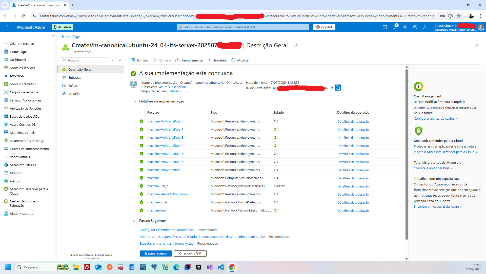
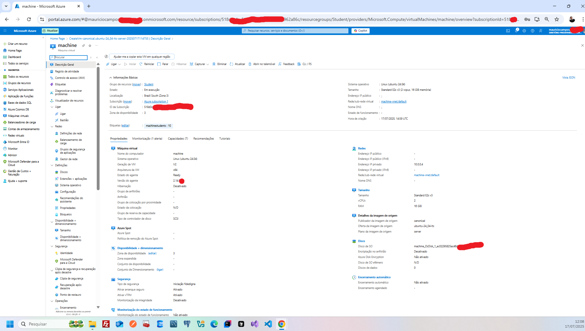

# ☁️ Estudo Técnico – Benefícios da Computação em Nuvem

Hoje, enquanto estudava os **Benefícios da Nuvem**, me concentrei em como esses conceitos podem ser aplicados para ajudar um cliente que ainda utiliza apenas ambientes físicos.  
Meu objetivo é entender como apresentar esses benefícios de forma **clara e convincente** durante o fechamento de um contrato.

Abaixo, resumo o que aprendi com foco técnico e aplicabilidade real:

---

## 1. 🔄 Alta Disponibilidade (SLA)

A **Alta Disponibilidade** garante que os serviços em nuvem estejam acessíveis praticamente o tempo todo, com SLAs (Service Level Agreements) que asseguram disponibilidade superior a **99,9%**.

### 💡 Vantagens para ambientes físicos:
- Evita quedas por falha de hardware ou energia;
- Provedores possuem **zonas e regiões de disponibilidade**;
- Redução de perdas financeiras por inatividade;
- **Failover automático** garante continuidade do serviço.

---

## 2. 📈 Escalabilidade e Elasticidade

### 🧱 Escalabilidade
Capacidade de **aumentar ou diminuir recursos** de forma planejada e controlada (ex: aumentar CPU, RAM ou armazenamento).

### ⚙️ Elasticidade
Capacidade de **ajustar automaticamente os recursos** com base na demanda. Exemplo: autoescalonamento durante picos de acesso.

### 💡 Benefícios para clientes tradicionais:
- Dispensa compra antecipada de hardware;
- Adaptação dinâmica a sazonalidades e campanhas;
- **Pagamento conforme uso**, sem desperdício de recursos.

---

## 3. 🔐 Confiabilidade, Previsibilidade e Segurança

### ✅ Confiabilidade
- Backup automatizado;
- Recuperação de desastres integrada;
- Alta tolerância a falhas.

### 📊 Previsibilidade
- Custos operacionais claros e mensais;
- Atualizações e manutenções realizadas pelo provedor.

### 🔐 Segurança
- Criptografia de dados em trânsito e em repouso;
- Monitoramento contínuo e políticas de acesso rigorosas;
- Conformidade com normas internacionais (ex: ISO, GDPR).

> 🧠 Importante: A nuvem costuma ser **mais segura que ambientes físicos**, graças ao investimento massivo dos provedores em infraestrutura e compliance.

---

## 4. 🛠️ Governança e Gerenciabilidade

### ⚖️ Governança
- Aplicação de **políticas corporativas** via ferramentas como `Azure Policy`;
- Garantia de conformidade com **regulamentações setoriais**.

### 📋 Gerenciabilidade
- **Painéis intuitivos** e ferramentas como:
  - `Azure Monitor`: para rastreamento de desempenho;
  - `Azure Advisor`: para otimização de custos e eficiência.

### 💡 Para ambientes físicos:
- Redução do tempo gasto com gestão manual;
- Maior foco no **core business** da empresa;
- Operações automatizadas e com visibilidade total.

---

## 🗣️ Como Apresentar Esses Benefícios ao Cliente

Durante uma negociação ou apresentação comercial, posso destacar exemplos práticos:

- **Alta Disponibilidade**:  
  > "Sua empresa não ficará mais offline devido a falhas em servidores locais."

- **Escalabilidade sob demanda**:  
  > "Durante campanhas sazonais, os recursos podem ser expandidos automaticamente."

- **Eficiência operacional**:  
  > "Sua equipe poderá focar no negócio principal enquanto a nuvem cuida da operação técnica."

- **Modelo econômico sob demanda**:  
  > "Sem necessidade de grandes investimentos iniciais."

---

## ✅ Conclusão

Estudar os **benefícios da nuvem** foi essencial para entender como **ajudar empresas a migrar de ambientes físicos para arquiteturas modernas, escaláveis e seguras**.

A computação em nuvem oferece soluções robustas para desafios comuns de TI, com:

- Alta disponibilidade;
- Escalabilidade inteligente;
- Segurança de nível empresarial;
- Governança eficiente.

> Agora me sinto mais preparado para **apresentar esses argumentos de forma técnica, estratégica e eficaz** durante o fechamento de contratos com clientes. 🚀

---

## Imagens

### Tela de configuração criada da maquina virtual Azure

### Tela da maquina virtual Azure

