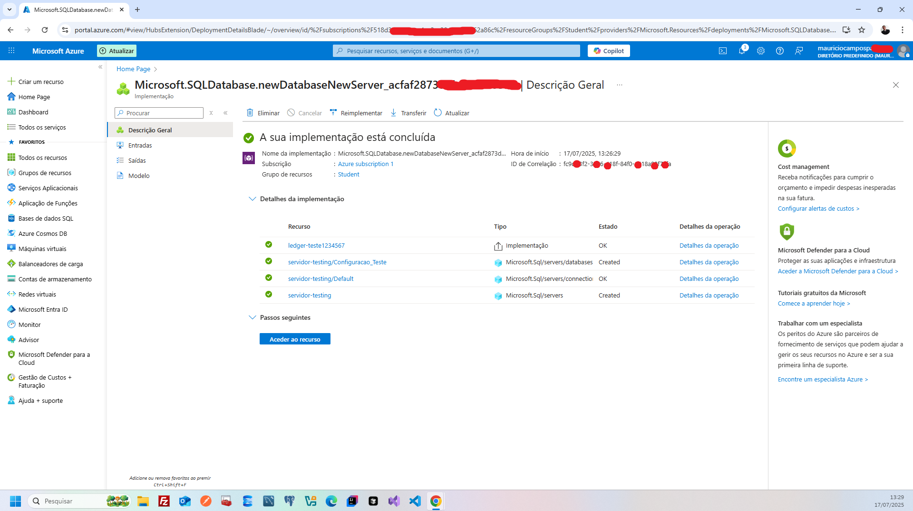
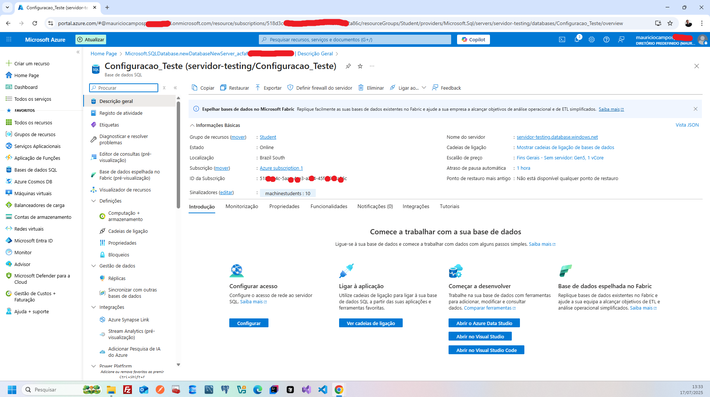

# ☁️ Estudo Técnico – Serviços de Nuvem e Banco de Dados na Azure

Hoje, enquanto estudava os **Benefícios da Nuvem no contexto da Microsoft Azure**, aprofundei meus conhecimentos em três áreas principais:

- Tipos de serviços em nuvem: **IaaS, PaaS e SaaS**;
- **Configuração de uma instância de banco de dados** na Azure;
- O **Modelo de Responsabilidade Compartilhada**.

Abaixo, compartilho um resumo técnico do que aprendi:

---

## 1. ⚙️ Configuração de uma Instância de Banco de Dados na Azure

A configuração de um banco de dados na Azure é simples, automatizada e segura. O processo envolve:

### 🔷 Etapas principais:

1. **Escolha do tipo de banco de dados**
   - `Azure SQL Database` (relacional)
   - `Cosmos DB` (NoSQL)
   - Outras opções especializadas

2. **Definição de recursos**
   - Tamanho da instância
   - Região geográfica
   - Políticas de **backup e recuperação**

3. **Configuração de segurança**
   - Regras de **firewall**
   - Autenticação (ex: Azure Active Directory)
   - Controle de acesso por usuários/grupos

4. **Monitoramento e otimização**
   - Uso de ferramentas como `Azure Monitor`
   - Ajuste dinâmico de recursos com base no desempenho

> ✅ A Azure automatiza grande parte do processo, o que permite até mesmo que iniciantes realizem essa configuração com confiança e segurança.

---

## 2. 🧱 IaaS, PaaS e SaaS na Azure

### 📦 IaaS – *Infrastructure as a Service*

- **O que é:** Infraestrutura sob demanda: VMs, rede e armazenamento.
- **Responsabilidade do cliente:** SO, aplicações e segurança de dados.
- **Caso de uso:** Migração de data centers, ambientes personalizados.
- **Exemplo na Azure:** `Azure Virtual Machines`

---

### 🛠️ PaaS – *Platform as a Service*

- **O que é:** Plataforma completa para desenvolvimento e implantação.
- **Responsabilidade do cliente:** Código e dados dos aplicativos.
- **Caso de uso:** Desenvolvimento ágil de aplicações sem se preocupar com infraestrutura.
- **Exemplo na Azure:** `Azure App Service`

---

### 💻 SaaS – *Software as a Service*

- **O que é:** Software pronto para uso via navegador ou app.
- **Responsabilidade do cliente:** Uso e segurança dos dados inseridos.
- **Caso de uso:** Ferramentas de produtividade e colaboração.
- **Exemplo na Azure:** `Microsoft 365` (Word, Excel, Teams)

---

> 🔍 **Resumo comparativo:**

| Modelo | Controle | Facilidade | Exemplo |
|--------|----------|------------|---------|
| IaaS   | Alto     | Médio      | Azure VMs |
| PaaS   | Médio    | Alto       | Azure App Service |
| SaaS   | Baixo    | Muito alto | Microsoft 365 |

---

## 3. 🔐 Modelo de Responsabilidade Compartilhada

Esse modelo define as **obrigações do cliente e do provedor de nuvem** em relação à segurança, operação e manutenção dos recursos.

### 📊 Níveis de responsabilidade por modelo:

| Elemento                         | IaaS              | PaaS                     | SaaS                 |
|----------------------------------|-------------------|--------------------------|----------------------|
| Infraestrutura física            | Provedor          | Provedor                 | Provedor             |
| Sistema operacional              | Cliente           | Provedor                 | Provedor             |
| Middleware / Plataforma          | Cliente           | Provedor                 | Provedor             |
| Aplicações                       | Cliente           | Cliente                  | Provedor             |
| Dados e identidade               | Cliente           | Cliente                  | Cliente              |
| Configurações de segurança       | Cliente           | Compartilhada            | Compartilhada        |

### 🔐 Segurança na prática:

- **Provedor:** Responsável pela segurança da nuvem (infraestrutura, rede, hardware).
- **Cliente:** Responsável pela segurança na nuvem (dados, permissões, criptografia).

> ⚠️ **Importante:** A migração para a nuvem não elimina a responsabilidade do cliente com segurança e conformidade.

---

## ✅ Conclusão

Estudar os serviços da Azure me permitiu compreender:

- Como **configurar e proteger bancos de dados na nuvem**;
- A diferença prática entre **IaaS, PaaS e SaaS**;
- A importância do **Modelo de Responsabilidade Compartilhada** para evitar riscos operacionais.

> Agora estou mais preparado para orientar empresas na jornada de migração para a nuvem, **esclarecendo os papéis de cada parte** e ajudando a extrair o máximo valor da plataforma Azure. 🚀

---

## Imagens

### Tela de configuração criada 

### Tela da instância de Banco de Daos na Azure

